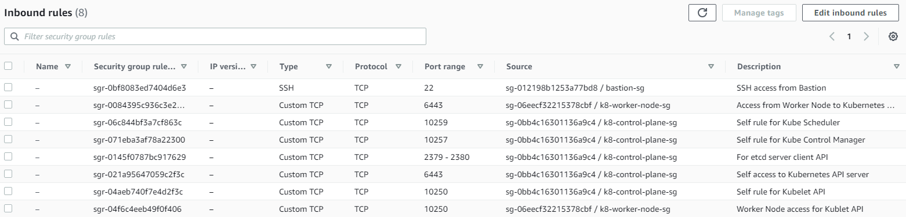
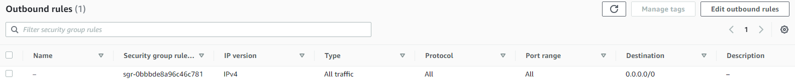
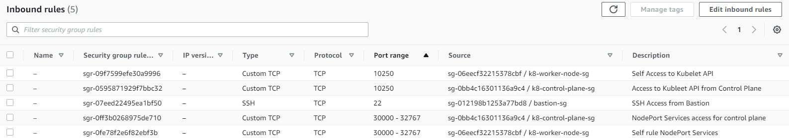
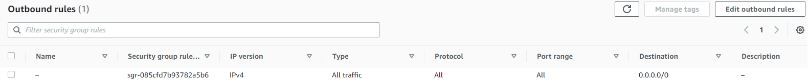

# Infrastructure
This setup is deployed on AWS. Details as below.

This is in line with, _System Requirements_ defined under "Before You Begin" in "Creating a cluster with kubeadm" 
in the reference.

1. **AMI**: _Ubuntu Server 22.04 LTS (HVM), SSD Volume Type_ (`ami-0287a05f0ef0e9d9a`) (AMI IDs are different in different AWS region. This is from Mumbai region)
2. **Instances**:
   1. **Bastion Host**: Acts as jump host to connect to control and worker nodes.
   2. 3 x **Control Nodes**: `t3a.medium`
   3. 3 x **Worker Nodes**: `t3a.small`
3. All instances are managed via **Auto Scaling Group** and **Launch Templates**.
   1. Launch Template uses start up [scripts](scripts) to set hostname for Control Plane and Worker nodes.
4. **Subnets**:
   1. 3 x **Private**: _Control Plane_ & _Worker_ Nodes are launched in **Private** Subnet.
   2. 1 x **Public**: _Bastion_ host is launched in **Public** Subnet.
5. NAT Gateway is launched in **Public Subnet** and associated with Private Subnet Route for any traffic outside AWS internal network.
   1. Public IP Allocation is required during NAT GW creation.
   > **Note:** Make sure to delete the NAT GW and release Public IP to avoid high AWS Cost.

6. **Security Groups** are created as defined in Kubernetes documentation [Ports and Protocols](https://kubernetes.io/docs/reference/networking/ports-and-protocols/). Reference as below.
   
   **Control Plane Ingress**
   

   **Control Plane Egress**
   

   **Worker Node Ingress**
   

   **Worker Node Egress**
   

7. TBC