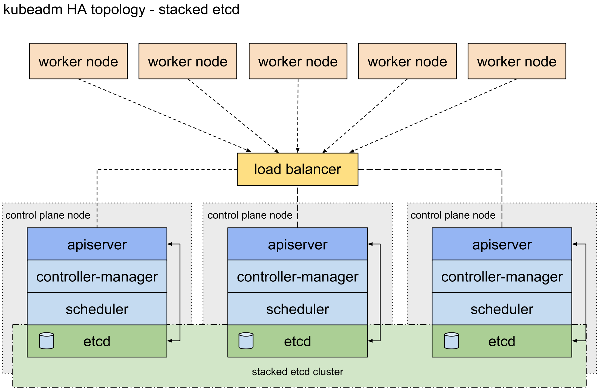

# High Availability Architecture
To achieve **High Availability**, following is the setup:
- **3 Control Plane** nodes (Master node).
  - `ETCD` deployed in **stacked** mode.
- **3 Worker Node**
- Network Load Balancer
  - In a cloud environment you should place your control plane nodes behind a TCP forwarding load balancer.
  - This load balancer distributes traffic to all healthy control plane nodes in its target list.
    - The health check for an `apiserver` is a TCP check on the port the `kube-apiserver` listens on (default value `:6443`). 

