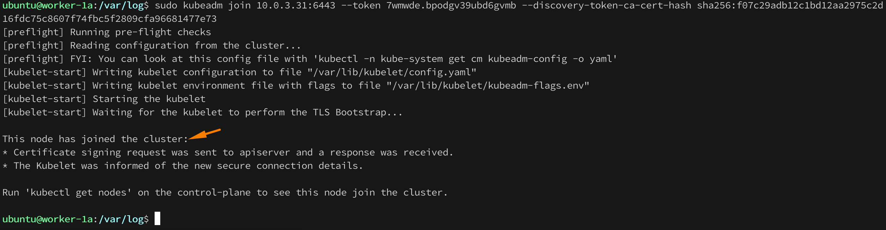
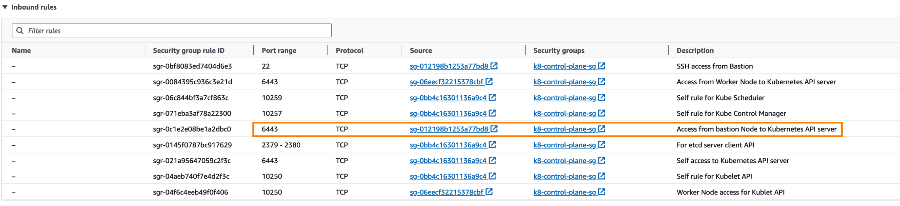
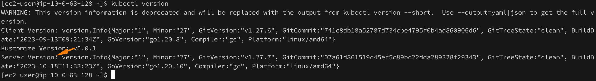

# Preparing a Host
## Install `CRI-O` Container Runtime 

> NOTE: I am using `cri-o` instead if `containerd` because, in Kubernetes certification exams, `cri-o` is used as the container runtime in the exam clusters.

> This step should be done on all 3 Control Plane nodes

> To install, choose a supported version of CRI-O for your operating system, and export it as a variable, like so: `export VERSION=1.19` 

To install on the `APT` based operating systems, set the environment variable **`$OS`** to the appropriate value from the following table:

| Operating system   | $OS               |
| ------------------ | ----------------- |
| Debian 12          | `Debian_12`       |
| Debian 11          | `Debian_11`       |
| Debian 10          | `Debian_10`       |
| Raspberry Pi OS 11 | `Raspbian_11`     |
| Raspberry Pi OS 10 | `Raspbian_10`     |
| Ubuntu 22.04       | `xUbuntu_22.04`   |
| Ubuntu 21.10       | `xUbuntu_21.10`   |
| Ubuntu 21.04       | `xUbuntu_21.04`   |
| Ubuntu 20.10       | `xUbuntu_20.10`   |
| Ubuntu 20.04       | `xUbuntu_20.04`   |
| Ubuntu 18.04       | `xUbuntu_18.04`   |

```shell
# Install CRI-O Runtime #

## Run the following as root ##
## Do this on all Control plane nodes ##

### switch to root user and update ###
sudo -i
apt update -y

##################
# Prerequisites  #
##################
## Disable swap &  turn off during reboots ##
swapoff -a
(crontab -l 2>/dev/null; echo "@reboot /sbin/swapoff -a") | crontab - || true

## Create the .conf file to load the modules at bootup ##
cat <<EOF | sudo tee /etc/modules-load.d/crio.conf
overlay
br_netfilter
EOF

sudo modprobe overlay
sudo modprobe br_netfilter

### Verify that the br_netfilter, overlay modules are loaded ##

lsmod | grep br_netfilter
lsmod | grep overlay

## Set up required sysctl params, these persist across reboots. ##
cat <<EOF | tee /etc/sysctl.d/99-kubernetes-cri.conf
net.bridge.bridge-nf-call-iptables  = 1
net.ipv4.ip_forward                 = 1
net.bridge.bridge-nf-call-ip6tables = 1
EOF

## Apply sysctl params without reboot ##
sysctl --system

### verify systctl params ###
sysctl net.bridge.bridge-nf-call-iptables net.bridge.bridge-nf-call-ip6tables net.ipv4.ip_forward

######################################
# Install packaged versions of CRI-O #
######################################
## This is Operating system version as per above instruction ##
export OS="xUbuntu_22.04"  

## This is kubernetes version for which CRI-O will be installed ##
export VERSION="1.27"

echo "deb [signed-by=/usr/share/keyrings/libcontainers-archive-keyring.gpg] https://download.opensuse.org/repositories/devel:/kubic:/libcontainers:/stable/$OS/ /" > /etc/apt/sources.list.d/devel:kubic:libcontainers:stable.list
echo "deb [signed-by=/usr/share/keyrings/libcontainers-crio-archive-keyring.gpg] https://download.opensuse.org/repositories/devel:/kubic:/libcontainers:/stable:/cri-o:/$VERSION/$OS/ /" > /etc/apt/sources.list.d/devel:kubic:libcontainers:stable:cri-o:$VERSION.list

mkdir -p /usr/share/keyrings

curl -L https://download.opensuse.org/repositories/devel:/kubic:/libcontainers:/stable/$OS/Release.key | gpg --dearmor -o /usr/share/keyrings/libcontainers-archive-keyring.gpg
curl -L https://download.opensuse.org/repositories/devel:/kubic:/libcontainers:/stable:/cri-o:/$VERSION/$OS/Release.key | gpg --dearmor -o /usr/share/keyrings/libcontainers-crio-archive-keyring.gpg

apt-get update
apt-get install cri-o cri-o-runc

## Reload systemd manager configuration ##
systemctl daemon-reload

## Enable to start at boot ##
systemctl enable crio --now

## Start crio service and verify status ##
systemctl start crio.service
systemctl status crio.service
```
## Installing `kubeadm`, `kubelet` and `kubectl`
These packages will be installed on all the machines
- **`kubeadm`**: the command to **bootstrap the cluster**.
- **`kubelet`**: the component that **runs on all the machines** in your cluster and does things like starting pods and containers.
- **`kubectl`**: the **command line utility** to talk to your cluster.

> **NOTE:** `kubeadm` **will not install or manage** `kubelet` or `kubectl` for you, so you will need to ensure they match the version of the Kubernetes control plane you want `kubeadm` to install for you.

>  One **minor** version _skew_ between the `kubelet` and the `control plane` is supported, but the `kubelet` version **may never exceed** the API server version. 

> **Note:** In releases older than Debian 12 and Ubuntu 22.04, /etc/apt/keyrings does not exist by default. You can create this directory if you need to, making it world-readable but writeable only by admins.

**`kubeadm init`** first runs a series of pre-checks to ensure that the machine is ready to run Kubernetes. 

These pre-checks expose warnings and exit on errors. 

`kubeadm init` then downloads and installs the cluster control plane components. This may take several minutes. 

The following message is disabled which suggests the master node is successfully initialized and also provides the command to join worker node to the cluster.


### Commands ##
```shell
# Install #
## Run the following as root ##
## Do this on all Control plane nodes ##

## Update the apt package index and install packages needed to use the Kubernetes apt repository ##
apt-get update
apt-get install -y apt-transport-https ca-certificates curl

## Download the Google Cloud public signing key ##
curl -fsSL https://dl.k8s.io/apt/doc/apt-key.gpg | sudo gpg --dearmor -o /etc/apt/keyrings/kubernetes-archive-keyring.gpg

## Add the Kubernetes apt repository ##
echo "deb [signed-by=/etc/apt/keyrings/kubernetes-archive-keyring.gpg] https://apt.kubernetes.io/ kubernetes-xenial main" | sudo tee /etc/apt/sources.list.d/kubernetes.list

## Update apt package index, install kubelet, kubeadm and kubectl, and pin their version ##
apt-get update
## Find version details ##
apt-cache madison kubeadm | tac

## Install specific version ##
apt-get install -y kubelet=1.27.7-00 kubeadm=1.27.7-00 kubectl=1.27.7-00

## Add hold to the packages to prevent upgrades ##
apt-mark hold kubelet kubeadm kubectl

## Add node IP to KUBELET_EXTRA_ARGS
apt-get install -y jq

local_ip="$(ip --json addr show ens5| jq -r '.[0].addr_info[] | select(.family == "inet") | .local')"

### Alternate to get the node IP ##
### local_ip="`ip addr|grep "inet "| awk -F'[: ]+' '{ print $3 }'|grep -v 127|cut -d"/" -f1`" 

cat <<EOF | sudo tee /etc/default/kubelet
KUBELET_EXTRA_ARGS=--node-ip=$local_ip
EOF

################################################
# Initialize kubeadm based on PUBLIC_IP_ACCESS #
################################################

### Extract private IP and hostname into variable to pass to kubeadm init command ###
IPADDR="`ip addr|grep "inet "| awk -F'[: ]+' '{ print $3 }'|grep -v 127|cut -d"/" -f1`"
NODENAME=$(hostname -s)
POD_CIDR="192.168.0.0/16"

kubeadm init --apiserver-advertise-address=$IPADDR  --apiserver-cert-extra-sans=$IPADDR  --pod-network-cidr=$POD_CIDR --node-name $NODENAME --ignore-preflight-errors Swap

#----------------------#
# In case of Public IP #
#----------------------#
## Only the IPADDR variables is the only change in comparison to above. ##
IPADDR=$(curl ifconfig.me && echo "")

######################## 
# Configure kubeconfig #
########################
## These instructions are part of output once Kubernetes control plane (using kubeadm init as above) is successfully initialized.
mkdir -p $HOME/.kube
sudo cp -i /etc/kubernetes/admin.conf $HOME/.kube/config
sudo chown $(id -u):$(id -g) $HOME/.kube/config

### If doing as root user ###
export KUBECONFIG=/etc/kubernetes/admin.conf

#################
# Verification  #
#################
## verify kubeconfig ##
kubectl get po -n kube-system

## Verify all cluster components are healthy ##
kubectl get --raw='/readyz?verbose'

## Get cluster info ##
kubectl cluster-info

## Note: By default, apps won’t get scheduled on the master node. ##
```

## Install Network Add-on
We are installing Calico Network Plugin

```shell
## Install the Tigera Calico operator and custom resource definitions ##
kubectl create -f https://raw.githubusercontent.com/projectcalico/calico/v3.26.3/manifests/tigera-operator.yaml

## Install Calico by creating the necessary custom resource. For more information on configuration options available in this manifest ##
kubectl create -f https://raw.githubusercontent.com/projectcalico/calico/v3.26.3/manifests/custom-resources.yaml

## Confirm that all of the pods are running with the following command. ##
## Wait until each pod has the STATUS of Running. ##
watch kubectl get pods -n calico-system

## OR ## 

kubectl get po -A
```

## Add Worker Node to Master
- On the Worker node, we have installed `cir-o`, `kubelet` and `kubeadm` utilities.
- To join worker node to master we need to use the `kuebadm join` command mentioned in the output of `kubeadm init`.
- If case the command was not copied or see the join command again
  ```shell
  kubeadm token create --print-join-command
  
  ## Example ##
  ubuntu@master-1a:~$ kubeadm token create --print-join-command
  kubeadm join 10.0.3.31:6443 --token 7wmwde.bpodgv39ubd6gvmb --discovery-token-ca-cert-hash sha256:f07c29adb12c1bd12aa2975c2d16fdc75c8607f74fbc5f2809cfa96681477e73
  ubuntu@master-1a:~$
  ```
- Below is sample output when executed from worker node. Use **`sudo`** if you running as a normal user. This command performs the TLS bootstrapping for the nodes.

  
- Verify the nodes in the cluster using `kubectl get nodes` from master node.
  ```shell
  ubuntu@master-1a:~$ kubectl get nodes
  NAME        STATUS   ROLES           AGE     VERSION
  master-1a   Ready    control-plane   30m     v1.27.6
  worker-1a   Ready    <none>          9m34s   v1.27.6
  ubuntu@master-1a:~$
  ```

## Configure `kubectl` to run outside from cluster
> **Note**:
> - The non-HA setup has control and worker nodes running with private IPs.
> - `kubectl` is setup on Bastion node
> - Security Group of control node should allow access on port 6443 to Bastion Host.

- `Kubectl` uses a config file you must have to connect to the cluster.
- Configure Control Plane SG to allow access from Bastion node on port 6443 as below
  
- Install `kubectl` as per instructions in [Install and setup kubectl on Linux](https://kubernetes.io/docs/tasks/tools/install-kubectl-linux/).
  - Sub-pages under parent page [Install Tools](https://kubernetes.io/docs/tasks/tools/) provide instructions to install on macOS and Windows. 
- **Download Kubernetes config From control node**:
  > **This is not an ideal way and a proper method will be updated later.**
  ```shell
  ## Example
  scp -r -i mumbai-key-pair.pem ubuntu@10.0.47.147/home/ubuntu/.kube/config .
  ```
- **Copy the Kubernetes Credentials your downloaded to your home directory**

  ```shell
  cp -r .kube $HOME/
  ```
- This should allow `kubectl` to connect to Remote Kubernetes cluster now. To test run the `kubectl version` command and it should list successful connection to master. Example output as below.
  

## `kubectl cheat sheet`
-  kubectl cheat sheet as in reference contains a list of commonly used kubectl commands and flags, some of which are mentioned below to get started. For more refer to the cheat sheet.

  ```shell
  ## Kubectl autocomplete ##
  source <(kubectl completion bash) # set up autocomplete in bash into the current shell, bash-completion package should be installed first.
  echo "source <(kubectl completion bash)" >> ~/.bashrc # add autocomplete permanently to your bash shell.
  
  ## Setup shorthand alias for kubectl with auto completion ##
  alias k=kubectl
  complete -o default -F __start_kubectl k
  
  ## Shorthand for --all-namespaces
  kubectl -A
  ```

## References
- [CRI-O Installation Instructions - Ubuntu](https://github.com/cri-o/cri-o/blob/main/install.md#apt-based-operating-systems)
- [Installing Kubernetes 1.27](https://v1-27.docs.kubernetes.io/docs/setup/production-environment/tools/kubeadm/install-kubeadm/)
- [Installing `kubectl`](https://v1-27.docs.kubernetes.io/docs/tasks/tools/install-kubectl-linux/)
- [`kubectl cheat sheet`](https://kubernetes.io/docs/reference/kubectl/cheatsheet/)
- [Installing Addons (Pod Network addons)](https://kubernetes.io/docs/concepts/cluster-administration/addons/)
- [Install Calico](https://docs.tigera.io/calico/latest/getting-started/kubernetes/quickstart#install-calico)