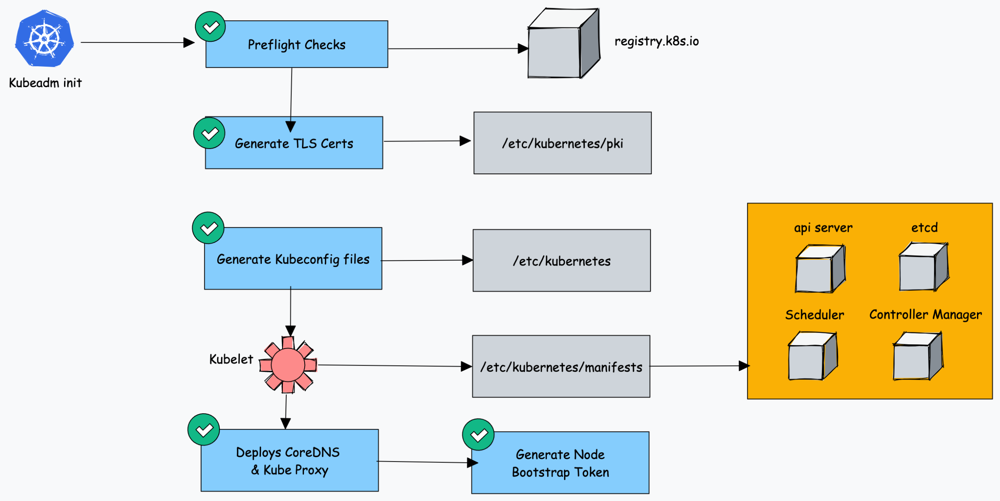

# Non-HA Architecture (single control-plane)
System requirements:
- One or more machine running a deb/rpm-compatible Linux OS; for example: Ubuntu or CentOS.
- 2 GiB of RAM per machine.
- At least 2 CPUs on the machine used as `control-plane` node.
- Full network connectivity among all machines in the cluster. You can use either a public or a private network.

## How `kubeadm` works
When we initialize a Kubernetes cluster using `kubeadm init`, it does the following in order
1. First it **runs all preflight checks** to validate the system state and downloads required cluster container images from **`registry.k8s.io`** registry.
2. It then **generates the TLS Certificates** and stores them in **`/etc/kubernetes/pki`** folder.
3. Next, it **generates all the** **`kubeconfig`** files for the cluster components in the **`/etc/kubernetes`** folder.
4. It then **starts** the **`kubelet`** service, **generates the static pod manifests** for all the cluster components and stores them in **`/etc/kubernetes/manifests`** folder.
5. It now **starts all the control plane components** from the static pod manifest files.
6. Now **`coreDNS`** and **`kubeproxy`** are installed.
7. Lastly, it **generates the node bootstrap token**. This token is used by `worker` node to **join** `control plane`.

   

## K8 Cluster Important Configuration

| **Configuration**                                                         | **Location**                  |
|---------------------------------------------------------------------------|-------------------------------|
| Static Pods Location (etcd, api-server, controller manager and scheduler) | `/etc/kubernetes/manifests`   |
| TLS Certificates (kubernetes-ca, etcd-ca and kubernetes-front-proxy-ca)   | `/etc/kubernetes/pki`         |
| Admin Kubeconfig File                                                     | `/etc/kubernetes/admin.conf`  |
| Kubelet configuration                                                    | `/var/lib/kubelet/admin.conf` |