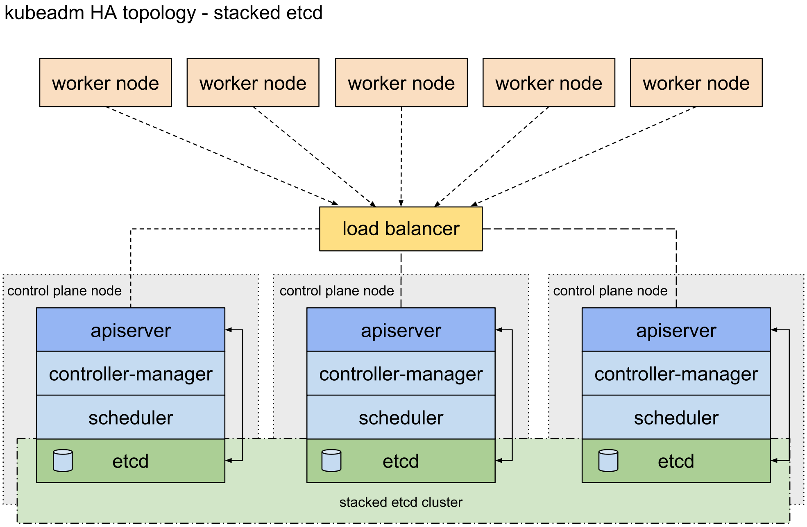

# Bootstrapping clusters with `kubeadm`
In this repo, I have covered setting a NON-HA (**single** `control-plane`) & High Available Kubernetes cluster using `Kubernetes version: v1.27`. 

In HA Setup, `ETCD` is deployed in **stacked** mode, i.e. the `etcd` members and `control plane` nodes are co-located.

### Non-HA Architecture (single control-plane)
System requirements:
- One or more machine running a deb/rpm-compatible Linux OS; for example: Ubuntu or CentOS.
- 2 GiB of RAM per machine.
- At least 2 CPUs on the machine used as `control-plane` node.
- Full network connectivity among all machines in the cluster. You can use either a public or a private network.
### High Availability Architecture

To achieve **High Availability**, following is the setup:
- **3 Control Plane** nodes (Master node).
  - `ETCD` deployed in **stacked** mode.
- **3 Worker Node**
- Network Load Balancer
  - In a cloud environment you should place your control plane nodes behind a TCP forwarding load balancer.
  - This load balancer distributes traffic to all healthy control plane nodes in its target list.
    - The health check for an `apiserver` is a TCP check on the port the `kube-apiserver` listens on (default value `:6443`). 

## High Level Steps
1. Install Container Runtime
2. Install `kubeadm`, `kubelet` & `kubectl`
3. Install Pod network add-on

## Instructions
1. [Non-HA](Non-HA)
2. [HA](HA)

## Future Task
Once manual setup is done, the next step will be to automate bootstrapping a k8 cluster using Ansible and Terraform.