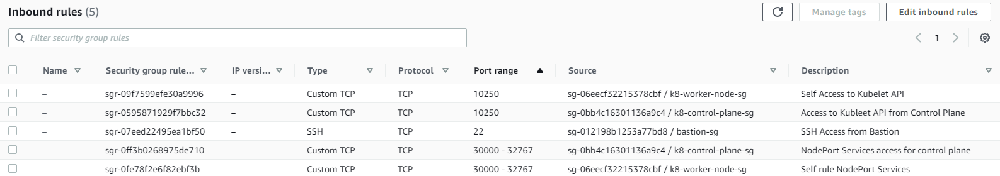
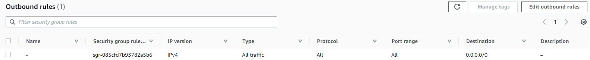

# Bootstrapping clusters with `kubeadm`
In this repo, I have covered setting a High Available Kubernetes cluster using `Kubernetes version: v1.27`. `ETCD` is deployed in stacked node, i.e. the `etcd` members and `control plane` nodes are co-located.

Using `kubeadm`, you can create a minimum viable Kubernetes cluster that conforms to best practices.

To achieve **High Availability**, following is the setup:
- **3 Control Plane** nodes (Master node).
  - `ETCD` deployed in **stacked** mode.
- **3 Worker Node**
- Network Load Balancer
  - In a cloud environment you should place your control plane nodes behind a TCP forwarding load balancer.
  - This load balancer distributes traffic to all healthy control plane nodes in its target list.
    - The health check for an `apiserver` is a TCP check on the port the `kube-apiserver` listens on (default value `:6443`). 

# Infrastructure
This setup is deployed on AWS Infrastructure. Details as below.

This is in line with, _System Requirements_ defined under "Before You Begin" in "Creating a cluster with kubeadm" 
in the reference.

1. **AMI**: _Ubuntu Server 22.04 LTS (HVM), SSD Volume Type_ (`ami-0287a05f0ef0e9d9a`) (AMI IDs are different in different AWS region. This is from Mumbai region)
2. **Instances**:
   1. **Bastion Host**: Acts as jump host to connect to control and worker nodes.
   2. 3 x **Control Nodes**: `t3a.medium`
   3. 3 x **Worker Nodes**: `t3a.small`
3. All instances are managed via **Auto Scaling Group** and **Launch Templates**.
   1. Launch Template uses start up [scripts](scripts) to set hostname for Control Plane and Worker nodes.
4. **Subnets**:
   1. 3 x **Private**: _Control Plane_ & _Worker_ Nodes are launched in **Private** Subnet.
   2. 1 x **Public**: _Bastion_ host is launched in **Public** Subnet.
5. NAT Gateway is launched in **Public Subnet** and associated with Private Subnet Route for any traffic outside AWS internal network.
   1. Public IP Allocation is required during NAT GW creation.
   > **Note:** Make sure to delete the NAT GW and release Public IP to avoid high AWS Cost.

6. **Security Groups** are created as defined in Kubernetes documentation [Ports and Protocols](https://kubernetes.io/docs/reference/networking/ports-and-protocols/). Reference as below.
   
   **Control Plane Ingress**
   

   **Control Plane Egress**
   

   **Worker Node Ingress**
   

   **Worker Node Egress**
   

7. TBC

# Instructions
## Preparing a Host
### Install `CRI-O` Container Runtime 

> NOTE: I am using `cri-o` instead if `containerd` because, in Kubernetes certification exams, `cri-o` is used as the container runtime in the exam clusters.

> This step should be done on all 3 Control Plane nodes

> To install, choose a supported version of CRI-O for your operating system, and export it as a variable, like so: `export VERSION=1.19` 

To install on the `APT` based operating systems, set the environment variable **`$OS`** to the appropriate value from the following table:

| Operating system   | $OS               |
| ------------------ | ----------------- |
| Debian 12          | `Debian_12`       |
| Debian 11          | `Debian_11`       |
| Debian 10          | `Debian_10`       |
| Raspberry Pi OS 11 | `Raspbian_11`     |
| Raspberry Pi OS 10 | `Raspbian_10`     |
| Ubuntu 22.04       | `xUbuntu_22.04`   |
| Ubuntu 21.10       | `xUbuntu_21.10`   |
| Ubuntu 21.04       | `xUbuntu_21.04`   |
| Ubuntu 20.10       | `xUbuntu_20.10`   |
| Ubuntu 20.04       | `xUbuntu_20.04`   |
| Ubuntu 18.04       | `xUbuntu_18.04`   |

```shell
# Install CRI-O Runtime #

## Run the following as root ##
## Do this on all Control plane nodes ##
apt update -y

##################
# Prerequisites  #
##################
## Disable swap &  turn off during reboots ##
swapoff -a
(crontab -l 2>/dev/null; echo "@reboot /sbin/swapoff -a") | crontab - || true

## Create the .conf file to load the modules at bootup ##
cat <<EOF | sudo tee /etc/modules-load.d/crio.conf
overlay
br_netfilter
EOF

sudo modprobe overlay
sudo modprobe br_netfilter

### Verify that the br_netfilter, overlay modules are loaded ##

lsmod | grep br_netfilter
lsmod | grep overlay

## Set up required sysctl params, these persist across reboots. ##
cat <<EOF | sudo tee /etc/sysctl.d/99-kubernetes-cri.conf
net.bridge.bridge-nf-call-iptables  = 1
net.ipv4.ip_forward                 = 1
net.bridge.bridge-nf-call-ip6tables = 1
EOF

## Apply sysctl params without reboot ##
sysctl --system

### verify systctl params ###
sysctl net.bridge.bridge-nf-call-iptables net.bridge.bridge-nf-call-ip6tables net.ipv4.ip_forward

######################################
# Install packaged versions of CRI-O #
######################################
## This is Operating system version as per above instruction ##
export OS="xUbuntu_22.04"  

## This is kubernetes version for which CRI-O will be installed ##
export VERSION="1.27"

echo "deb [signed-by=/usr/share/keyrings/libcontainers-archive-keyring.gpg] https://download.opensuse.org/repositories/devel:/kubic:/libcontainers:/stable/$OS/ /" > /etc/apt/sources.list.d/devel:kubic:libcontainers:stable.list
echo "deb [signed-by=/usr/share/keyrings/libcontainers-crio-archive-keyring.gpg] https://download.opensuse.org/repositories/devel:/kubic:/libcontainers:/stable:/cri-o:/$VERSION/$OS/ /" > /etc/apt/sources.list.d/devel:kubic:libcontainers:stable:cri-o:$VERSION.list

mkdir -p /usr/share/keyrings

curl -L https://download.opensuse.org/repositories/devel:/kubic:/libcontainers:/stable/$OS/Release.key | gpg --dearmor -o /usr/share/keyrings/libcontainers-archive-keyring.gpg
curl -L https://download.opensuse.org/repositories/devel:/kubic:/libcontainers:/stable:/cri-o:/$VERSION/$OS/Release.key | gpg --dearmor -o /usr/share/keyrings/libcontainers-crio-archive-keyring.gpg

apt-get update
apt-get install cri-o cri-o-runc

## Reload systemd manager configuration ##
systemctl daemon-reload

## Enable to start at boot ##
systemctl enable crio --now

## Start crio service and verify status ##
systemctl start crio.service
systemctl status crio.service
```
### Installing `kubeadm`, `kubelet` and `kubectl`
These packages will be installed on all the machines
- **`kubeadm`**: the command to **bootstrap the cluster**.
- **`kubelet`**: the component that **runs on all the machines** in your cluster and does things like starting pods and containers.
- **`kubectl`**: the **command line utility** to talk to your cluster.

> **NOTE:** `kubeadm` **will not install or manage** `kubelet` or `kubectl` for you, so you will need to ensure they match the version of the Kubernetes control plane you want `kubeadm` to install for you.

>  One **minor** version _skew_ between the `kubelet` and the `control plane` is supported, but the `kubelet` version **may never exceed** the API server version. 

> **Note:** In releases older than Debian 12 and Ubuntu 22.04, /etc/apt/keyrings does not exist by default. You can create this directory if you need to, making it world-readable but writeable only by admins.

```shell
# Install #
## Run the following as root ##
## Do this on all Control plane nodes ##

## Update the apt package index and install packages needed to use the Kubernetes apt repository ##
apt-get update
apt-get install -y apt-transport-https ca-certificates curl

## Download the Google Cloud public signing key ##
curl -fsSL https://dl.k8s.io/apt/doc/apt-key.gpg | sudo gpg --dearmor -o /etc/apt/keyrings/kubernetes-archive-keyring.gpg

## Add the Kubernetes apt repository ##
echo "deb [signed-by=/etc/apt/keyrings/kubernetes-archive-keyring.gpg] https://apt.kubernetes.io/ kubernetes-xenial main" | sudo tee /etc/apt/sources.list.d/kubernetes.list

## Update apt package index, install kubelet, kubeadm and kubectl, and pin their version ##
apt-get update
## Find version details ##
apt-cache madison kubeadm | tac

## Install specific version ##
apt-get install -y kubelet=1.27.7-00 kubeadm=1.27.7-00 kubectl=1.27.7-00

## Add hold to the packages to prevent upgrades ##
apt-mark hold kubelet kubeadm kubectl
```


## References: 
- [Creating a cluster with kubeadm](https://v1-27.docs.kubernetes.io/docs/setup/production-environment/tools/kubeadm/create-cluster-kubeadm/)
- [CRI-O Installation Instructions - Ubuntu](https://github.com/cri-o/cri-o/blob/main/install.md#apt-based-operating-systems)
